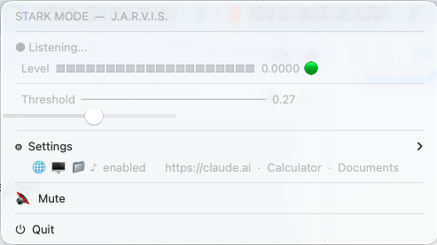

# ⚡ STARK MODE

> A clap-activated macOS menu bar app inspired by Tony Stark's J.A.R.V.I.S.  
> Clap your hands (or make any loud sound) and watch your workspace come to life.

---

## What it does

STARK MODE sits silently in your macOS menu bar, listening through your microphone. When it detects a sudden loud sound — a clap, a snap, or a knock on the desk — it fires a configurable sequence of actions:

- Opens a URL in your browser (e.g. your email or Claude.ai)
- Launches a macOS application (e.g. Terminal, Calculator, Spotify)
- Opens a folder in Finder
- Plays an MP3 file (your own J.A.R.V.I.S. theme)

Everything is configurable and persisted across sessions. No word recognition — just sound level detection, fast and local.

---

## Preview



The menu bar icon (`⚡`) shows a live VU-meter that animates with the microphone input (`⚡▁` → `⚡█`). When triggered it switches to `✦`, and to `🔇` when muted.

When STARK MODE fires, a **Stop** button appears inline to immediately cancel music and reset the cooldown:

```
✦  ACCESS GRANTED — Welcome, Sir.
⏹  Stop STARK MODE                  ← only visible when active
```

---

## Requirements

- **macOS** (uses native AppKit / rumps — Windows/Linux not supported)
- **Python 3.8+**
- Microphone access (macOS will ask for permission on first run)

---

## Installation

```bash
# 1. Clone the repository
git clone https://github.com/javiersiguenza/JARVIS.git
cd JARVIS

# 2. (Optional but recommended) create a virtual environment
python3 -m venv .venv
source .venv/bin/activate

# 3. Install dependencies
pip install -r requirements.txt
```

---

## Adding your music file

The app plays an MP3 when activated. This file is **not included** in the repository (copyright).

1. Find your own audio file — a J.A.R.V.I.S. startup sound, an Iron Man theme clip, or any MP3 you like.
2. Place it in the project folder and **name it `jarvis.mp3`**:

```
tony-stark/
├── stark_menubar.py
├── requirements.txt
├── jarvis.mp3          ← put your MP3 here
└── README.md
```

> **Tip:** If you want to use a different filename or path, open the app, click  
> **⚙ Settings → ♪ Music file** and enter the new path. It will be saved automatically.

If no MP3 is found, the app still works — it just skips the music step silently.

---

## Usage

```bash
python3 stark_menubar.py
```

The **⚡** icon will appear in your menu bar. Clap or make a loud noise to trigger STARK MODE.

> **macOS microphone permission:** On first run, macOS will show a permission dialog.  
> Click **OK** — without it, the app cannot hear the microphone.

---

## Configuration

All settings are saved automatically in `stark_config.json` (gitignored) and restored on next launch.

### Threshold (sensitivity)

Click the menu bar icon and drag the slider:

| Threshold | When it triggers |
|-----------|-----------------|
| `0.01 – 0.03` | Voice, background noise — very sensitive |
| `0.05 – 0.10` | Moderate clap — **default (`0.08`)** |
| `0.15 – 0.30` | Hard clap or desk knock |
| `0.30 – 0.50` | Very loud sound only |

The **Level** bar and the 🟢/🔴 indicator help you calibrate in real time.

### Settings submenu (⚙)

| Option | Description |
|--------|-------------|
| 🌐 Browser URL | Any URL — your email, Claude, a dashboard… |
| 🖥 System app | Any app name from `/Applications` (e.g. `Terminal`, `Spotify`, `Notes`) |
| 📁 Folder to open | Full path; `~` is supported |
| ♪ Music file | Full path to your MP3, or just the filename if it lives next to the script |

### Enable / Disable features

Inside **⚙ Settings → Enable / Disable**, each feature has a native macOS checkmark toggle. Uncheck any you don't want — the setting is saved immediately.

---

## File structure

```
tony-stark/
├── stark_menubar.py    # main app
├── requirements.txt    # Python dependencies
├── .gitignore
├── README.md
├── jarvis.mp3          # your MP3 — not tracked by git
└── stark_config.json   # auto-generated — not tracked by git
```

---

## How it works

1. `sounddevice` opens a microphone stream and reads audio blocks at 44 100 Hz.
2. Each block's RMS (Root Mean Square) is calculated — a measure of volume.
3. If the RMS exceeds the threshold for `CONFIRM_FRAMES` (3) consecutive blocks, STARK MODE fires.
4. A 10-second cooldown prevents accidental re-triggers.
5. `rumps` renders the native macOS menu bar UI; a `rumps.Timer` at 100 ms updates the live VU-meter.
6. All actions (browser, app, folder, music) respect the per-feature toggles stored in `stark_config.json`.

---

## Troubleshooting

**The app doesn't detect sound**  
→ Go to **System Settings → Privacy & Security → Microphone** and make sure Python (or Terminal) is allowed.

**`ModuleNotFoundError`**  
→ Run `pip install -r requirements.txt` again inside the correct Python environment.

**`sounddevice` fails on macOS**  
→ Install PortAudio: `brew install portaudio`, then `pip install sounddevice` again.

**The app triggers with normal noise**  
→ Increase the threshold by dragging the slider to the right.

**The app never triggers even with loud claps**  
→ Decrease the threshold by dragging the slider to the left. Watch the Level bar — it should turn 🔴 when you clap.

---

## License

MIT — do whatever you want with the code. Just don't commit copyrighted audio files to a public repository.
